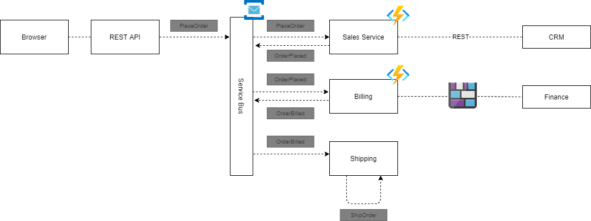

# Retail demo environment using NServiceBus & Azure Functions

This demo uses `NServiceBus` as messaging, `Azure Service Bus` as transport and `Azure Table Storage` as persistence.
It is created to demo commands, events, saga's and versioning of messages.

## Infrastructure as Code
Use the `servicebus-topology.ps1` to create the Service Bus namespace, storage account, endpoints and subscriptions.

## Flow of messages
1. The rest api places an order.
2. The sales functions app handles the `PlaceOrderV1` and `PlaceOrderV2` commands.
    - In case of the `PlaceOrderV2` command it contacts CRM via a HttpClient
3. The sales functions app publishes an `OrderPlaced` event.
4. The billing functions app handles the `OrderPlaced` event and creates a Blob.
5. The billing functions app publishes an `OrderBilled` event.
6. The shipping console app uses a saga to complete the shipping policy based on both the `OrderPlaced` and the `OrderBilled` events.
